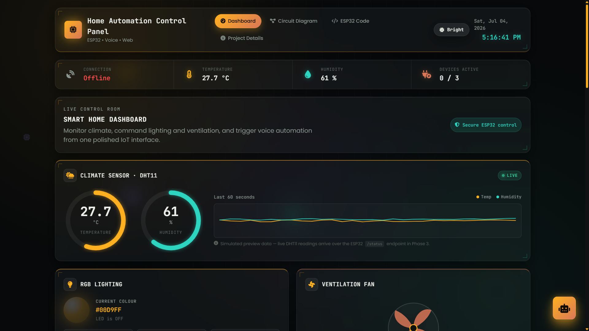
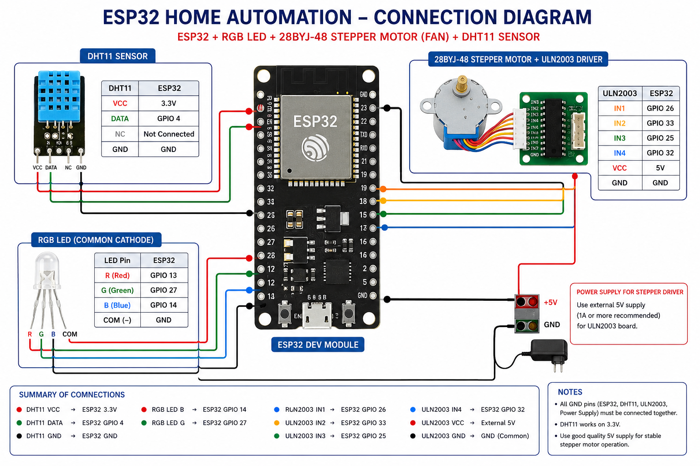
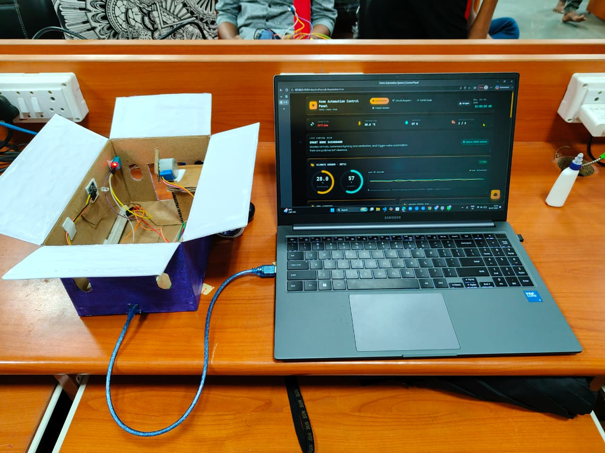

# 🏠 Home Automation Through Voice Commands

A smart home automation system built with **ESP32 + HTML + CSS + JavaScript**. Control lights and a fan, and monitor temperature/humidity, from a web dashboard on your local Wi-Fi network — no app install needed.

---

## 🧠 What This Project Does (30-Second Summary)

1. An **ESP32 board** is wired to RGB LEDs, a stepper motor (fan), and a DHT11 sensor.
2. The ESP32 runs a tiny **web server** and exposes simple REST API endpoints like `/red/on` or `/fan/off`.
3. A **web dashboard** (just HTML/CSS/JS, open in any browser) talks to the ESP32 over Wi-Fi using those endpoints.
4. The dashboard shows live LED status, fan status, temperature, humidity, Wi-Fi signal, and mode — updating in real time.
5. You can control everything manually, or flip to **Auto Mode**, where the fan turns on/off by itself based on temperature and humidity thresholds.
6. A built-in chat assistant, **Aero AI**, explains how the project works if you have questions — it doesn't control hardware, it's just a guide.

That's the whole system: **browser dashboard ⇄ Wi-Fi ⇄ ESP32 ⇄ sensors/actuators.**

---

## 🏗️ How It Works (Flow)

```text
        You (Browser)
              │
              ▼
     Web Dashboard (HTML/CSS/JS)
              │
     sends HTTP requests (REST API)
              │
              ▼
      ESP32 Web Server
    ┌─────────┼──────────┐
    ▼         ▼          ▼
RGB LEDs   Fan Motor   DHT11 Sensor
    │         │          │
    └─────────┼──────────┘
              │
   ESP32 replies with JSON
   (status, temp, humidity, mode)
              │
              ▼
   Dashboard updates instantly
```

**Step by step:**
1. ESP32 connects to your Wi-Fi and starts a web server.
2. Dashboard sends a request (e.g. "turn fan on").
3. ESP32 controls the hardware and reads the DHT11 sensor.
4. ESP32 sends back current status as JSON.
5. Dashboard refreshes automatically — no page reload needed.
6. In **Auto Mode**, the ESP32 decides fan on/off by itself using temperature/humidity thresholds. In **Manual Mode**, you decide.

---

## ✨ Features

- 🌐 ESP32 hosts its own web server (no cloud, no app)
- 💡 Control 3 RGB LEDs individually
- 🌀 Control a stepper-motor fan
- 🌡️ Live temperature & humidity readout (DHT11)
- ⚙️ Manual mode (you control) or Auto mode (system decides)
- 📶 Live Wi-Fi signal strength
- 📱 Responsive dashboard — works on phone or desktop
- 🤖 Aero AI chat assistant explains the project on request

---

## 🤖 Aero AI Assistant

A chat widget on the dashboard that answers questions about the project itself — e.g. *"How does Auto Mode work?"* or *"What sensor is used?"* It's informational only and does not send hardware commands.

---

## 🛠 Hardware Used

| Component | Qty |
|---|---|
| ESP32 Dev Board | 1 |
| DHT11 Temperature & Humidity Sensor | 1 |
| 28BYJ-48 Stepper Motor | 1 |
| ULN2003 Driver Module | 1 |
| Red / Green / Blue LEDs | 1 each |
| 220Ω Resistors | 3 |
| Breadboard + Jumper Wires | As needed |

---

## 💻 Software & Tech Stack

Arduino IDE · HTML5 · CSS3 · JavaScript (ES6) · ESP32 Arduino Core · REST API · VS Code · Git/GitHub

**Required Arduino libraries:** `WiFi.h`, `WebServer.h`, `DHT.h`, `Adafruit_Sensor.h`, `AccelStepper.h`

---

## 🌐 REST API Endpoints

| Endpoint | Method | What It Does |
|---|---|---|
| `/status` | GET | Full system status |
| `/sensor` | GET | Temperature + humidity |
| `/red/on` `/red/off` | GET | Red LED on/off |
| `/green/on` `/green/off` | GET | Green LED on/off |
| `/blue/on` `/blue/off` | GET | Blue LED on/off |
| `/fan/on` `/fan/off` | GET | Fan on/off |
| `/mode/auto` | GET | Switch to Auto Mode |
| `/mode/manual` | GET | Switch to Manual Mode |

---

## 📂 Project Structure

```text
Home-Automation/
│
├── index.html
├── README.md
├── esp32code.txt
│
├── css/
│   ├── style.css
│   └── ai-assistant.css
│
├── js/
│   ├── script.js
│   └── ai-assistant.js
│
└── diagram/
    └── diagram_pic.png
```

---

## 🚀 Getting Started

**1. Clone the repo**
```bash
git clone https://github.com/biswajitbiswal-in/Home-Automation.git
```

**2. Flash the ESP32**
- Open Arduino IDE → install the ESP32 board package.
- Install the required libraries listed above.
- Update your Wi-Fi SSID/password in the code.
- Upload to the ESP32.

**3. Open the dashboard**
- Open `index.html` in a browser, or run it via VS Code's Live Server extension.

---

## 📷 Project Images

**Dashboard**
<p align="center"></p>

**Circuit Diagram**
<p align="center"></p>

**Hardware Setup**
<p align="center"></p>

---

## 🔮 Future Enhancements

🎙️ Voice commands · ☁️ Cloud database · 📊 Data logging · 📱 Android app · 🌍 Remote internet access · 🔔 Smart notifications · 📈 Energy monitoring · 🔐 User authentication

---

## 👨‍💻 Author

**Biswajit Biswal**
B.Tech, Computer Science & Engineering — Gandhi Institute for Technology (GIFT), Bhubaneswar, Odisha, India
Internship Project at National Institute of Technology (NIT), Rourkela

---

## 📄 License

Developed for educational and learning purposes.

⭐ If this project helped you, consider starring it on GitHub.
